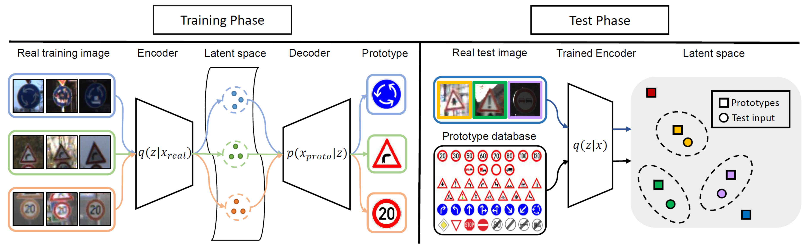

## Variational Prototyping-Encoder: One-Shot Learning with Prototypical Images

IEEE Conference on Computer Vision and Pattern Recognition (CVPR) 2019

We tackle an open-set graphic symbol recognition problem by one-shot classification with prototypical images as a single training example for each novel class. We take an approach to learn a generalizable embedding space for novel tasks. We propose a new approach called variational prototyping-encoder (VPE) that learns the image translation task from real-world input images to their corresponding prototypical images as a meta-task. As a result, VPE learns image similarity as well as prototypical concepts which differs from widely used metric learning based approaches. Our experiments with diverse datasets demonstrate that the proposed VPE performs favorably against competing metric learning based one-shot methods. Also, our qualitative analyses show that our meta-task induces an effective embedding space suitable for unseen data representation.

### Citation
Please cite our paper in your publications if it helps your research:
    
    @InProceedings{Kim_2019_CVPR,
      author = {Kim, Junsik and Oh, Tae-Hyun and Lee, Seokju and Pan, Fei and Kweon, In So},
      title = {Variational Prototyping-Encoder: One-Shot Learning with Prototypical Images},
      booktitle = {The IEEE Conference on Computer Vision and Pattern Recognition (CVPR)},
      month = {June},
      year = {2019}
    }

### Code
 
Will be updated

### Contact
mibastro@gmail.com
